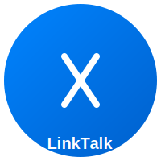

# 📱 LinkTalk - Design System & Assets

## Wizualizacja projektu

### 🎨 Kolorystyka aplikacji

LinkTalk posiada 4 główne warianty kolorystyczne, które mogą być wybierane przez użytkowników:

#### 1️⃣ **Messenger Blue** (#0084FF)
- Inspiracja: Facebook Messenger
- Gradient: #0084FF → #0060CC
- Idealna dla: Klasycznych, nowoczesnych interfejsów

#### 2️⃣ **WhatsApp Green** (#25D366)
- Inspiracja: WhatsApp
- Gradient: #25D366 → #128C44
- Idealna dla: Komunikacji, zaufania

#### 3️⃣ **iMessage Purple** (#A855F7)
- Inspiracja: Apple iMessage
- Gradient: #A855F7 → #7C3AED
- Idealna dla: Nowoczesności, elegancji

#### 4️⃣ **Energetic Orange** (#FF6B35)
- Inspiracja: Dynamika i energia
- Gradient: #FF6B35 → #FF4500
- Idealna dla: Młodzieży, dynamiki

---

## 📦 Zawartość katalogów

### Icons (`assets/images/icons/`)
- ✉️ `send-blue.svg`, `send-green.svg`, `send-purple.svg`, `send-orange.svg` - Ikonka wysyłania
- 📎 `attachment.svg` - Załączanie plików
- 🎤 `mic.svg` - Nagrywanie audio
- 😊 `emoji.svg` - Dodawanie emotikon
- ☰ `menu.svg` - Menu główne
- ⚙️ `settings.svg` - Ustawienia
- 🔍 `search.svg` - Wyszukiwanie

### Logos (`assets/images/logos/`)
- 🔵 `linktalk-blue.svg` - Logo w kolorze niebieskim
- 🟢 `linktalk-green.svg` - Logo w kolorze zielonym
- 🟣 `linktalk-purple.svg` - Logo w kolorze fioletowym
- 🟠 `linktalk-orange.svg` - Logo w kolorze pomarańczowym

### Avatars (`assets/images/avatars/`)
- 👤 `avatar-placeholder-blue.svg` - Placeholder w kolorze niebieskim
- 👤 `avatar-placeholder-green.svg` - Placeholder w kolorze zielonym
- 👤 `avatar-placeholder-purple.svg` - Placeholder w kolorze fioletowym
- 👤 `avatar-placeholder-orange.svg` - Placeholder w kolorze pomarańczowym

### Backgrounds (`assets/images/backgrounds/`)
- ☀️ `chat-bg-light.svg` - Jasne tło do czatu
- 🌙 `chat-bg-dark.svg` - Ciemne tło do czatu

---

## 🎯 Struktura szkieletu aplikacji

### Szkielet responsywny

```
┌─────────────────────────────────────────────┐
│          HEADER/NAVIGATION BAR              │
│  [Logo] [Search] [Settings] [User Profile] │
└─────────────────────────────────────────────┘
┌──────────────────┬──────────────────────────┐
│                  │                          │
│  LISTA ROZMÓW    │     OKNO CZATU          │
│                  │                          │
│ • Rozmowa 1 [*]  │  User 1: Cześć!        │
│ • Rozmowa 2      │                         │
│ • Rozmowa 3      │  User 2: Cześć! 👋    │
│ • Rozmowa 4      │                         │
│ • Rozmowa 5      │  User 1: Jak się masz? │
│                  │                         │
│ [+ Nowa]         │  [Wpisz wiadomość...] │
│                  │  [😊] [📎] [🎤] [Send]│
└──────────────────┴──────────────────────────┘
```

### Komponenty UI

#### 1. Header
- Logo LinkTalk (dynamicznie zmienia kolor)
- Pasek wyszukiwania
- Przycisk ustawień
- Profil użytkownika

#### 2. Sidebar - Lista rozmów
- Wyszukiwanie rozmów
- Lista wszystkich konwersacji
- Liczba nieprzeczytanych wiadomości [*]
- Przycisk dodania nowej rozmowy
- Scrollbar

#### 3. Main Chat Area
- Nagłówek z informacjami o użytkowniku
- Historia wiadomości
- Wiadomości własne (po prawej, kolor brand)
- Wiadomości drugiej strony (po lewej, szare)
- Oznaczenia czasu
- Avatary użytkowników

#### 4. Input Area
- Pole tekstowe do wpisywania
- Przycisk emoji 😊
- Przycisk załącznika 📎
- Przycisk mikrofonu 🎤
- Przycisk wysyłania (Send)

---

## 🎨 Paleta kolorów

### Neutral Colors
- Biały: `#FFFFFF`
- Szary jasny: `#F0F0F0`
- Szary: `#E5E5EA`
- Szary ciemny: `#999999`
- Czarny: `#000000`
- Bardzo ciemny: `#1A1A1A`

### Brand Colors (4 warianty)
- Blue: `#0084FF`
- Green: `#25D366`
- Purple: `#A855F7`
- Orange: `#FF6B35`

---

## 📐 Rozmiary i typografia

### Font Stack
```css
font-family: 'Segoe UI', Tahoma, Geneva, Verdana, sans-serif;
```

### Rozmiary
- **H1**: 32px, Bold
- **H2**: 24px, Bold
- **Body**: 16px, Regular
- **Small**: 14px, Regular
- **XSmall**: 12px, Regular

### Spacing
- XS: 4px
- SM: 8px
- MD: 16px
- LG: 24px
- XL: 32px

---

## 🚀 Wdrażanie

Wszystkie assety SVG można bezpośrednio importować do projektu React/Vue/Angular:

```html
<!-- HTML -->


<!-- CSS Background -->
<div style="background-image: url('assets/images/backgrounds/chat-bg-light.svg')"></div>
```

```jsx
// React
import LogoBlue from '@/assets/images/logos/linktalk-blue.svg';

export default function App() {
  return ;
}
```

---

## ✅ Checklist implementacji

- [x] Definicja kolorystyki
- [x] Projekt ikon
- [x] Design logo
- [x] Avatary
- [x] Tła
- [ ] Prototyp UI (Figma/Adobe XD)
- [ ] Responsywność mobile
- [ ] Dark mode
- [ ] Animacje przejść
- [ ] Dokumentacja komponentów

---

**Created**: 2026-07-10  
**Project**: LinkTalk  
**Version**: 1.0.0
